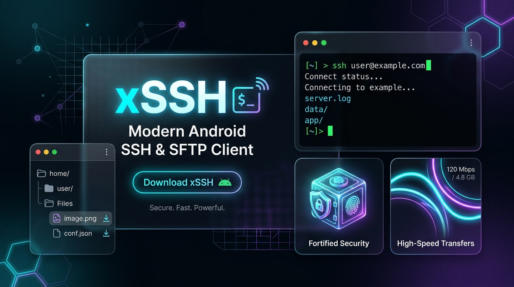
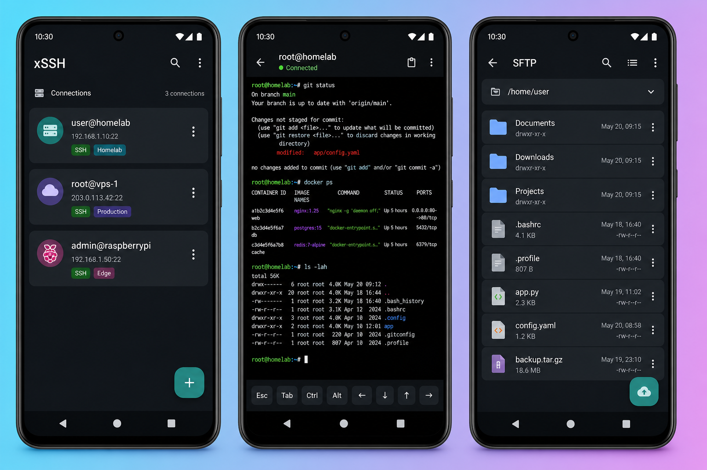
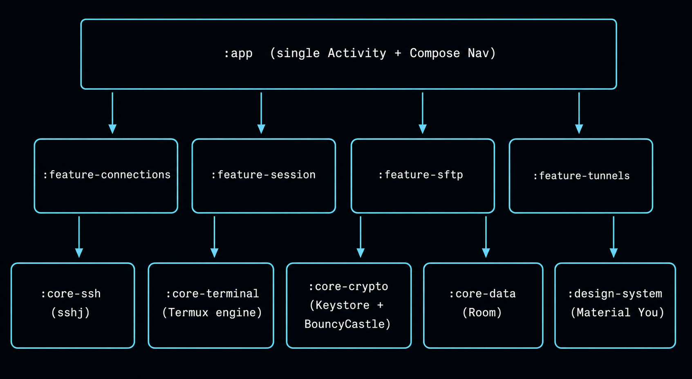

# xSSH

<p align="center">
    
</p>

<h3 align="center">Open. Fast. Private.</h3>
<p align="center">
A local-first, open-source SSH client for Android.
</p>



> **Project status — pre-alpha.** The code base now includes a working
> profile editor for password / public-key / keyboard-interactive / agent auth,
> passphrase-aware private-key import and in-app Ed25519 key generation,
> a migration/import/export toolkit, a biometric-before-connect toggle, a
> queued SFTP transfer pipeline, and an in-app quick-edit path for small UTF-8
> text files, but it must not be used to administer production systems until
> the P0 gates in
> [`docs/RELEASE_BLOCKERS.md`](docs/RELEASE_BLOCKERS.md) are closed and
> verified on physical devices. See [`docs/CHANGELOG.md`](docs/CHANGELOG.md)
> for what changed at each checkpoint.

## Product thesis

xSSH exists to make the reliable, offline-first parts of the Android SSH
experience available without an account, subscription gate, ad SDK, analytics
SDK, or opaque cloud vault. The user's own Android keyboard is the keyboard;
xSSH supplies only a slim optional modifier bar for terminal keys a phone IME
does not have (Ctrl, Alt, Esc, Tab, arrows).

## Product direction



### v1 capability matrix

| Capability | Status |
|---|---|
| SSH2 profiles, tags, full-text search, quick connect | ✅ implemented (Room-backed) |
| System IME + hardware keyboard support (no custom keyboard) | ✅ Termux emulator + system-IME bridge |
| xterm terminal emulation, 24-bit color, scrollback | ✅ via Termux `terminal-emulator` |
| Password authentication | ✅ explicit profile editor + encrypted persistence |
| Ed25519 / ECDSA / RSA private-key auth | ✅ import/generate + passphrase-aware loading |
| Keyboard-interactive auth | ✅ profile selection + prompt dialog wired through session flow |
| SSH agent authentication | ✅ app-managed encrypted key, agent-style signing, end-to-end connect flow |
| Android Keystore / StrongBox encrypted secret vault | ✅ AES-256-GCM sealed blobs |
| Biometric pre-connect gate | ✅ optional UI gate before interactive sessions; vault keys are not biometric-bound |
| Strict host-key TOFU + fail-closed on change | ✅ + timeout-safe |
| SFTP browser (list, mkdir, rename, delete, up/download) | ✅ with queued transfers + SAF + quick text edit |
| Local (`-L`), remote (`-R`), dynamic SOCKS5 (`-D`) forwarding | ✅ via sshj + shared sessions |
| Command snippets + paste-into-session | ✅ Room-backed |
| Migration / import / export | ✅ xSSH bundle JSON + OpenSSH/JuiceSSH-style config migration |
| Modifier bar (Ctrl/Alt/Esc/Tab/arrows) | ✅ |
| Foreground service for background sessions and tunnels | ✅ |
| No analytics, no telemetry, no ads, no subscription server | ✅ CI-enforced |

See [`docs/COMPETITION_2026.md`](docs/COMPETITION_2026.md) for the evidence-led
competitive target and [`docs/RELEASE_BLOCKERS.md`](docs/RELEASE_BLOCKERS.md)
for the honest path to a usable release.

## Architecture



```
:app                    one Activity, Compose navigation, Hilt DI, app-launch tunnel restore
:design-system          Material 3 / Material You theme, host-key dialogs
:core-ssh               sshj transport, host-key policy, tunnels, SOCKS5, SFTP
:core-terminal          Termux terminal engine + system-IME bridge + modifier bar
:core-crypto            Keystore vault, biometric gate, key material helpers
:core-data              Room database, DAOs, entities, Hilt DI module
:feature-connections    profiles, edit screen, encrypted repository
:feature-session        live terminal, foreground service, snippet paste
:feature-sftp           remote file browser and transfers
:feature-tunnels        local / remote / SOCKS forwards with shared sessions
:feature-snippets       reusable commands
```

Detailed data-flow and threading notes in
[`docs/ARCHITECTURE.md`](docs/ARCHITECTURE.md).

## Privacy contract

The full contract is documented in [`docs/PRIVACY.md`](docs/PRIVACY.md).
Summary:

- No account required.
- No analytics, crash reporting, advertising or remote configuration SDK.
- CI runs `./gradlew verifyNoTelemetry` on every pull request; the build fails
if a banned SDK slips into the resolved dependency graph.
- Private material never appears in logs, clipboard by default, cloud backup,
device-transfer backup, or plaintext persistence.
- `FLAG_SECURE` hides terminal contents from screenshots and task previews.

## Build prerequisites

- Current stable Android Studio
- JDK 17
- Android SDK Platform 36
- Android NDK 28.2.13676358 (Gradle/CI installs it automatically)
- A physical Android 12+ device for validation

```bash
# Bootstrap a verified Gradle wrapper once, if gradle-wrapper.jar is absent.
gradle wrapper --gradle-version 8.13 --distribution-type all

./gradlew :app:assembleDebug
./gradlew :app:installDebug
./gradlew verifyNoTelemetry --no-configuration-cache
./gradlew ktlintCheck detekt
./gradlew testDebugUnitTest
python3 scripts/verify_native_alignment.py app/build/outputs/apk/debug/app-debug.apk
```

For a locally signed release on Windows, provision the key once, back up the
generated keystore and credentials, then build the Release variant in Android
Studio or from PowerShell:

```powershell
.\scripts\provision-release-signing.ps1
.\gradlew.bat :app:assembleRelease
python .\scripts\verify_native_alignment.py .\app\build\outputs\apk\release\app-release.apk
```

The provisioner refuses to replace an existing key. The keystore and its
credentials remain ignored by Git; CI continues to use injected repository
secrets.

## Testing

Every feature module ships JVM unit tests. Coverage highlights:

- **`core-ssh`** — host-key TOFU acceptance, changed-key refusal, tunnel model
invariants, and strict algorithm allowlists.
- **`core-crypto`** — Ed25519/ECDSA key generation, OpenSSH `authorized_keys`
formatting, SHA-256 fingerprint prefix.
- **`core-terminal`** — special-key byte sequences (Esc, Tab, arrows, PgUp/Dn).
- **`feature-connections`** — mapper round-trip, auth-mode switching, secret-preservation on partial
update, AuthMethod integer encoding, seal-before-Room contract, and migration codec coverage.
- **`feature-tunnels`** — TunnelRepository entity round-trip (LOCAL / REMOTE /
DYNAMIC), Flow observation, connection-scoped filtering.
- **`feature-snippets`** — blank-label guard, CRUD flow through DAO, ordering.
- **`feature-session`** — BackgroundActivityController counter clamping,
promote/demote sequence, 100× stress test.

Full guide: [`docs/TESTING.md`](docs/TESTING.md). Release evidence lives in
[`docs/RELEASE_VALIDATION_CHECKLIST.md`](docs/RELEASE_VALIDATION_CHECKLIST.md)
and [`docs/DEVICE_TEST_MATRIX_API31_33_35_36.md`](docs/DEVICE_TEST_MATRIX_API31_33_35_36.md).

## Security reporting

See [`docs/SECURITY.md`](docs/SECURITY.md). Do **not** file public issues for
vulnerabilities.

## Contributing

Read [`CONTRIBUTING.md`](CONTRIBUTING.md) before submitting a PR. The biggest
contribution right now is helping close the release gates, with test evidence.

## License

Apache 2.0 for xSSH source. The APK includes
[`THIRD_PARTY_NOTICES.txt`](app/src/main/assets/THIRD_PARTY_NOTICES.txt) for
bundled component attribution.
